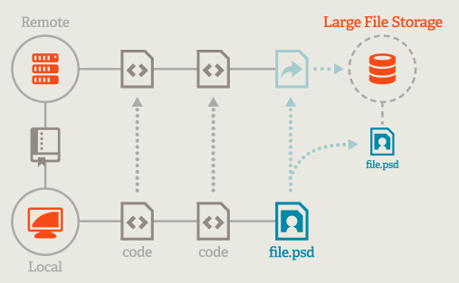
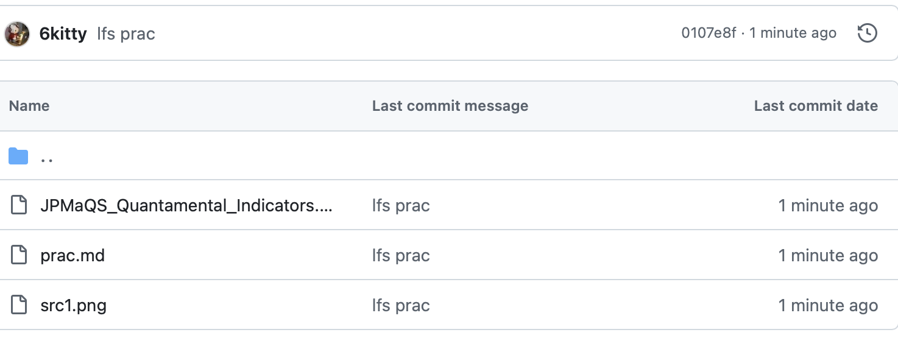

# git LFS 실습 

: 대용량 파일을 github에 push할 때 사용하는 스토리지이다. 



별도의 서버에 파일을 올리고 거기서 github로 적재되지만, 포인터는 원래 위치에 있기 때문에 사용자가 push, pull로 컨트롤 가능하다 

---

## install 

```bash
brew install git-lfs
```

mac 기준 위와 같이 터미널에 입력하여 설치한다. 

---

## use

타겟은 그냥 kaggle에서 퀀트 관련한 데이터셋 가져왔다. 30MB이면 깃허브 기준 적은 용량은 아니다. 

### 1. 사용 선언 

```bash 
git lfs install
```

Updated Git hooks.
Git LFS initialized.
이라고 뜨면 오류 없이 선언된 것이다. 

### 2. git track 해제 

```bash 
git rm --cached <파일 경로>
```

나의 경우는 % git rm --cached ./LFS-prac/JPMaQS_Quantamental_Indicators.csv

근데 지금은 git add . 도 안 해줘서 tracked가 안되는 상태이다. 일단 아래서 lfs track 설정하고 git add 속성으로 넣어주자. 

### 3. git lfs track 설정 

```bash 
git lfs track ./LFS-prac/JPMaQS_Quantamental_Indicators.csv
```

명령어를 입력하면 .gitattributes가 생긴 것을 알 수 있다. 

### git add .gitattributes 

제목은 .gitattributes로 명시하였지만 나는 csv로 넣어야 하니까 `git add .` 으로 처리하고 커밋 메세지를 작성해주자 

### push

