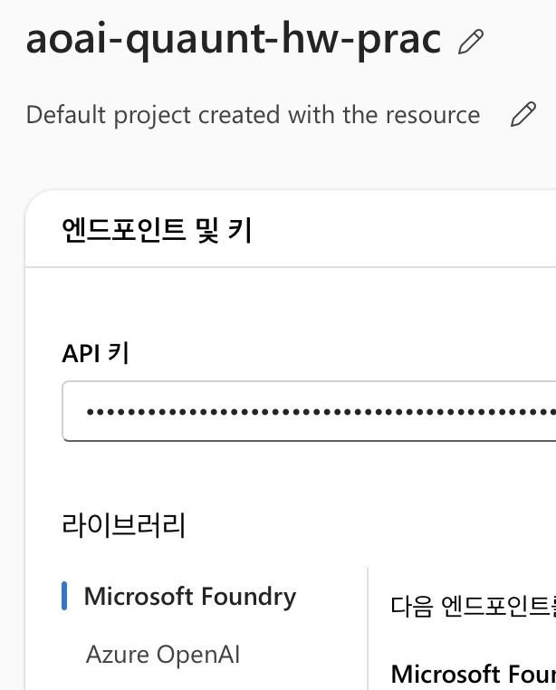

# Azure AOAI 실습

> 다루는 내용:
> 1. AIProjectClient + WebSearchTool로 web search 및 citations 분리
> 2. Pydantic 모델 기반 구조화된 응답 (Structured Outputs)
> 3. `/openai/v1/` 신규 엔드포인트 연결 방식

---

# Azure 리소스 생성

여러 개 생성해보느라 애먹긴 했지만, 결론적으로 **Foundry 리소스 하나 생성**하고 거기 포털에서 건드는 것이 좋다.

## 리소스 생성 전 트러블슈팅

리소스 유효성 검사가 계속 reject 당해서 만들 수가 없었다. 아래 방법 세 가지 차례로 했더니 됐다.

### 1. 카드 등록

구독 업그레이드를 눌러서 Azure for student에서 기본($0)으로 업그레이드하면서 카드 등록을 진행했다.

### 2. 테넌트 수정

홈 > 기본 디렉터리|속성 > 관리에 들어가서 하단에 **Azure 리소스에 대한 액세스 관리**를 ON했다.
'내 계정은 이 테넌트의 모든 Azure 구독과 관리 그룹에 대한 액세스를 관리할 수 있습니다' 이 부분을 켜줬다.

### 3. 정책 수정

홈 > 리소스 관리자|구독 > 정책 관리에서 하단에 허용된 사용자에 내 계정을 추가했다.

이렇게 해주고 **East US**로 생성하였다.

---

## Foundry 라이브러리



Foundry를 만들고 포털에 접속해주면 세 가지 라이브러리를 사용할 수 있다.

| # | 엔드포인트 | 설명 |
|---|-----------|------|
| 1 | Microsoft Foundry 프로젝트 엔드포인트 | 배포된 모든 기본 모델 호출 |
| 2 | Azure OpenAI 엔드포인트 | Azure OpenAI 모델 호출 |
| 3 | Azure AI Services 엔드포인트 | Computer Vision, 문서 인텔리전스, 언어, 번역 등 |

3번은 별로 쓸 일은 없을 것 같고 1번 2번 간 호출도 조금 달랐는데

**1번 (Foundry 프로젝트) — AIProjectClient**

```py
from azure.identity import DefaultAzureCredential
from azure.ai.projects import AIProjectClient
from azure.ai.projects.models import PromptAgentDefinition, WebSearchTool

project = AIProjectClient(
    endpoint=os.environ["AZURE_FOUNDRY_ENDPOINT"],
    credential=DefaultAzureCredential(),
)

openai = project.get_openai_client()
```

AIProjectClient는 credential이 있어야 해서 azure cli를 깔아줘야 한다.

```bash
brew install azure-cli
az login
```

**2번 (Azure OpenAI) — AzureOpenAI**

```py
client = AzureOpenAI(
    api_key=os.environ["AZURE_OPENAI_KEY"],
    azure_endpoint=os.environ["AZURE_OPENAI_ENDPOINT"],
    api_version="2024-08-01-preview",  # Structured Outputs 지원 버전
)
```

api version이 계속 not supported라고 해서 당황스러웠는데 여러 번 돌리니까 되는 게 있어서 넘어갔다.
[문서](https://learn.microsoft.com/en-us/azure/foundry/openai/api-version-lifecycle?tabs=python)를 읽어보니 api version이 필요 없다고 해서 `aoai_prac4.py`로 활용했다.

---

# AIProjectClient 활용 웹 검색

| 구성요소 | 역할 |
|---------|------|
| `AIProjectClient` + `DefaultAzureCredential` | az login 기반 인증 |
| `WebSearchTool` | Bing 기반 웹 검색 수행 |
| `openai.responses.create()` | streaming으로 응답 수신 |
| `annotation.type == "url_citation"` | citations 분리 |

## 실행 결과

<details>
<summary>전체 출력 보기</summary>

```
=== 분석 결과 ===
삼성전자(005930.KS)의 현재 시장 상황과 반도체 업황 전망을, 2026년 3월 26일 기준으로 정리합니다.

1. 삼성전자 현재 시장 상황

1.1 주가 동향 및 밸류에이션
- 종가 약 ₩180,100 (전일 대비 –4.71%)
- 최근 3개월 +87.6%, 연초 대비 +57% 이상

1.2 재무 지표 및 기업가치
- 시가총액 약 ₩1,200조, 선행 PER 7.6배, PEG 0.16
- Debt/Equity ≈ 0.06, Current Ratio ≈ 2.33

1.3 단기 실적 전망
- 2026년 1Q 영업이익 컨센서스 약 ₩38조 (+470% YoY)

=== 출처 목록 ===
[1] Samsung Electronics (KRX:005930) Stock Price & Overview
    https://stockanalysis.com/quote/krx/005930/
...
```

</details>

## 코드 리뷰

### Agent 생성 및 실행

```py
agent = project.agents.create_version(
    agent_name="finance-analyst",
    definition=PromptAgentDefinition(
        model="gpt-4o",
        instructions="당신은 금융 시장 애널리스트입니다. 최신 데이터를 검색해 분석하세요.",
        tools=[WebSearchTool()],
    ),
    description="Web search agent for financial analysis.",
)

stream_response = openai.responses.create(
    stream=True,
    tool_choice="required",
    input="삼성전자 현재 시장 상황과 반도체 업황 전망을 분석해주세요.",
    extra_body={"agent_reference": {"name": agent.name, "type": "agent_reference"}},
)
```

### Stream 이벤트 파싱

```py
class Citation(BaseModel):
    title:   str
    url:     str
    content: Optional[str] = None

citations: list[Citation] = []
text_parts: list[str] = []

for event in stream_response:
    if event.type == "response.output_text.delta":
        text_parts.append(event.delta)
    elif event.type == "response.output_item.done":
        if event.item.type == "message":
            item = event.item
            if item.content and item.content[-1].type == "output_text":
                for annotation in item.content[-1].annotations:
                    if annotation.type == "url_citation":
                        citations.append(Citation(
                            title=getattr(annotation, "title", annotation.url),
                            url=annotation.url,
                        ))
```

stream_response마다 불러와서 타입을 체크한다. `response.output_item.done`이면 message를 뜯어서 citations를 넣는다.

### event.type 종류

**응답 생명주기**

| event.type | 발생 시점 | 주요 필드 |
|-----------|---------|---------|
| `response.created` | 응답 객체 생성됨 | `event.response.id` |
| `response.in_progress` | 응답 처리 중 | `event.response` |
| `response.completed` | 응답 완전 종료 | `event.response.output_text` |
| `response.failed` | 에러 발생 | `event.response` |
| `response.cancelled` | 취소됨 | - |

**텍스트 스트리밍**

| event.type | 발생 시점 | 주요 필드 |
|-----------|---------|---------|
| `response.output_text.delta` | 텍스트 토큰 한 조각 도착 | `event.delta` ← 현재 코드에서 사용 |
| `response.output_text.done` | 텍스트 완전히 완료 | `event.text` (전체 텍스트) |

**출력 아이템**

| event.type | 발생 시점 | 주요 필드 |
|-----------|---------|---------|
| `response.output_item.added` | 새 아이템(메시지/툴콜 등) 시작 | `event.item` |
| `response.output_item.done` | 아이템 완료 + annotations 포함 | `event.item` ← citations 추출 |

**툴 호출 (web search 내부 동작)**

| event.type | 발생 시점 |
|-----------|---------|
| `response.web_search_call.in_progress` | Bing 검색 시작 |
| `response.web_search_call.searching` | 검색 중 |
| `response.web_search_call.completed` | 검색 완료 |

`response.output_text.delta` 타입인 애들은 다 텍스트 쪼가리들이다. 그래서 다 `text_parts`로 넣어주고 추후에 join으로 합쳐서 내보낸다.

```py
project.agents.delete_version(agent_name=agent.name, agent_version=agent.version)

analysis_text = "".join(text_parts)
```

> `delete_version`은 꼭 해주자. agent를 생성하면 Azure Foundry 프로젝트에 영구적으로 남아서 리소스를 낭비한다.

---

# 구조화된 응답 with Pydantic

```py
from openai import AzureOpenAI

client = AzureOpenAI(
    api_key=os.environ["AZURE_OPENAI_KEY"],
    azure_endpoint=os.environ["AZURE_OPENAI_ENDPOINT"],
    api_version="2024-08-01-preview",  # Structured Outputs 지원 버전
)
```

이번엔 `AzureOpenAI` 활용이다. 개인적으로 1번에서 쓴 `DefaultAzureCredential`은 로컬에서만 토큰 인증할 수 있어서 배포용으로는 이게 더 적합하지 않나 싶다.

| 요소 | 역할 |
|-----|------|
| `BaseModel` | 응답 JSON 스키마 정의 |
| `client.beta.chat.completions.parse()` | Structured Output 전용 메서드 |
| `response_format=StockOutlook` | Pydantic 모델 직접 전달 |
| `response.choices[0].message.parsed` | 자동 파싱된 Pydantic 객체 반환 |

> `api_version="2024-08-01-preview"` 이상이어야 Structured Outputs가 지원된다.

## 실행 결과

```
=== 구조화된 분석 결과 ===
종목코드  : 005930.KS
회사명    : 삼성전자
현재가    : 69,700 원
투자의견  : 매수
목표주가  : 75,000 원

요약 : 삼성전자는 글로벌 리더로서 반도체, 가전제품, 스마트폰 등 여러 분야에서 탁월한 성과를 내고 있습니다.

리스크 요인:
  1. 반도체 업황의 주기적 변동
  2. 글로벌 공급망 이슈
  3. 환율 변동에 따른 수익성 영향
```

## 코드 리뷰

Pydantic 모델을 `response_format`에 직접 던져주면 LLM이 해당 스키마에 맞는 JSON으로 응답한다.

```py
class StockOutlook(BaseModel):
    ticker: str
    company_name: str
    current_price_krw: Optional[float]
    recommendation: str           # BUY / HOLD / SELL
    target_price_krw: Optional[float]
    summary: str
    risks: list[str]

response = client.beta.chat.completions.parse(
    model="gpt-4o",
    messages=[...],
    response_format=StockOutlook,  # Pydantic 모델을 직접 전달
)

result: StockOutlook = response.choices[0].message.parsed
```

### response 구조체

```
response (ParsedChatCompletion)
│
├── id                        # 요청 고유 ID
├── model                     # 사용된 모델명
├── created                   # Unix timestamp
├── usage
│   ├── prompt_tokens
│   ├── completion_tokens
│   └── total_tokens
│
└── choices: list
    └── [0] (ParsedChoice)
        ├── index             # 0
        ├── finish_reason     # "stop" / "length" / "content_filter"
        │
        ├── message (ParsedChatCompletionMessage)
        │   ├── role          # "assistant"
        │   ├── content       # JSON 문자열 (raw)
        │   └── parsed        # ← Pydantic 모델로 자동 파싱된 객체
        │
        └── logprobs          # None (기본)
```

`message.content`는 raw JSON 문자열, `message.parsed`는 타입이 지정된 Pydantic 객체다. 둘 다 사용 가능하다.

### choices가 배열인 이유

`n` 파라미터로 같은 프롬프트에 대해 응답을 여러 개 생성할 수 있기 때문이다. 기본값은 `n=1`.

| 활용 사례 | 설명 |
|---------|------|
| A/B 비교 | 같은 질문에 여러 응답 생성 후 가장 좋은 것 선택 |
| 다양성 확보 | 창작, 아이디어 브레인스토밍 |
| Self-consistency | 여러 응답의 다수결로 정확도 향상 |

> `n`이 많아지면 토큰 사용량도 n배. Structured Output에서는 `n=1`만 지원.

---

# Azure OpenAI `/openai/v1/` 신규 엔드포인트

기존 `AzureOpenAI()` 대신 표준 `OpenAI()` 클라이언트 사용. 과제는 아니지만 문서를 봤으니까 써봤다.

- `api_version` 파라미터 불필요 (자동 관리)
- 새 기능 출시 시 코드 변경 없이 자동 적용
- Responses API (`client.responses.create`) 지원
- DeepSeek, Grok 등 멀티 프로바이더 모델 동일 문법으로 호출 가능

## 실행 결과

```
=== Chat Completions ===
삼성전자 반도체 업황은 글로벌 경기 불확실성과 수요 둔화로 단기적 도전에 직면했으나,
AI 및 첨단 기술 수요 증가로 중장기 성장 가능성이 기대됩니다.

=== Responses API ===
HBM(High Bandwidth Memory)은 고성능 컴퓨팅을 위해 설계된 메모리 기술로,
칩 내부에 메모리 셀을 3D로 적층하여 높은 대역폭과 낮은 전력 소비를 제공합니다.

=== Structured Output (v1 엔드포인트) ===
티커       : 005930.KS
센티먼트   : Positive
주요 동력  : Strong earnings performance in the recent quarter.
한줄 요약  : Samsung Electronics is currently viewed positively.
```

## prac2 vs prac4 클라이언트 비교

| 항목 | prac2 (`AzureOpenAI`) | prac4 (`OpenAI`) |
|-----|----------------------|-----------------|
| 클라이언트 | `AzureOpenAI()` | `OpenAI()` |
| 엔드포인트 경로 | `/openai/deployments/{model}/chat/completions` | `/openai/v1/chat/completions` |
| `api_version` | 명시 필요 (`2024-08-01-preview`) | 없음 |
| model 파라미터 | 배포 이름 (deployment name) | 모델 이름 그대로 |
| Responses API | 없음 | `client.responses.create()` 가능 |
| 멀티 프로바이더 | Azure OpenAI 모델만 | DeepSeek, Grok 등도 동일 문법 |

Structured Output 호출 자체(`beta.chat.completions.parse`)와 결과 접근법(`choices[0].message.parsed`)은 완전히 동일하다. 차이는 클라이언트와 엔드포인트 레이어에만 있다.
