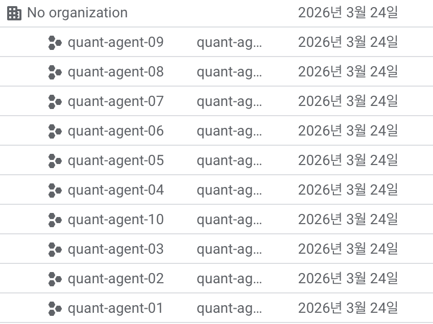

# rate limit 해결하기

## 1. gcloud 10개 생성

무료 계정으로 1플젝 당 1 API key



## 2. 각 프로젝트마다 Gen API 키 생성

https://aistudio.google.com/api-keys

여기서 만든 프로젝트 다 가져오고 API 키를 생성한다.

그리고 .env에 넣어준다.
.env는 .gitignore 처리할 것

## 3. rotation 코드 생성

Gemini 모델이 잘하는 것 (gemini-2.0-flash 기준):

| 강점 | 설명 |
|---|---|
| 속도 | Flash/Flash-Lite는 응답 지연이 매우 낮음 — 배치 처리에 최적 |
| 긴 컨텍스트 | 1M 토큰 입력 지원 → 긴 문서/보고서 통째로 분석 가능 |
| 한국어 | 영어와 성능 차이가 적고 한국어 금융 텍스트에 강함 |
| 구조화 출력 | JSON 모드로 정형 데이터 추출 안정적 |
| 코드 생성 | 파이썬/SQL 코드 생성 수준 높음 |

Free tier 한계: 15 RPM per key → 키 10개면 이론상 150 RPM

코드는 두 개가 있는데 각 코드마다 약간의 차이가 있다.

- **GeminiKeyPool.py** : genai 구조체로 프로세스 전체 API 키 설정(config)를 덮어쓴다. 때문에 스레드 병렬 처리는 불가하고
- **bench_parallel.py** : 이건 스레드 1개 당 키 1개로 실행되도록 설정하였다.

## 패키지

```bash
uv add google-generativeai  # 이건 현재 deprecated 되었다고 한다.
uv add google-genai          # 이걸로 깔아줘야함
```

Free tier에서 쓸 수 있는 모델:

| 모델 | Free RPM |
|---|---|
| gemini-1.5-flash | 15 RPM |
| gemini-1.5-flash-8b | 15 RPM |
| gemini-2.0-flash | 15 RPM (별도 확인 필요) |

한정적인 API 요청을 하도 많이 돌렸더니 RPD를 다 소진해서 수치 표현은 못헀다..
