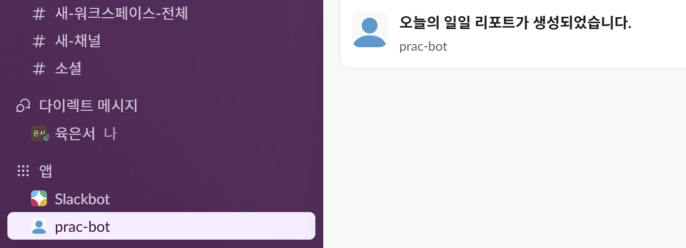
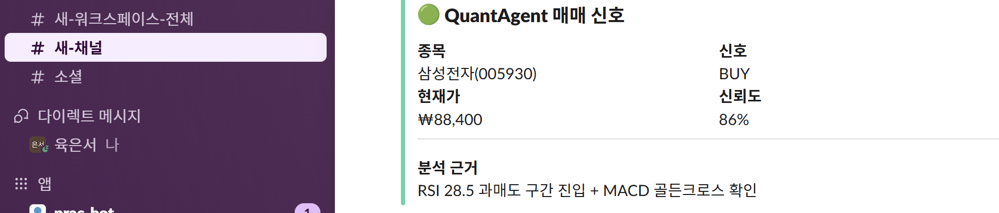

# slack API 활용

## 요약: 중요 코드 모음 

`from slack_sdk import *` 해준 뒤 아래 def 참고해서 사용하면 된다. 

```py 
def send_dm(user_email: str, text: str) -> bool:
    try:
        # 이메일로 user_id 조회
        resp = client.users_lookupByEmail(email=user_email)
        user_id = resp["user"]["id"]

        # DM 채널 열기
        dm = client.conversations_open(users=[user_id])
        channel_id = dm["channel"]["id"]

        # 메시지 발송
        client.chat_postMessage(
            channel=channel_id,
            text=text,
            unfurl_links=False,
        )
        return True
    except SlackApiError as e:
        print(f"Slack 오류: {e.response['error']}")
        return False
```

```py
def send_channel_notice(channel_id: str, title: str, body: str) -> bool:
    blocks = [
        {
            "type": "header",
            "text": {"type": "plain_text", "text": f"📢 {title}"}
        },
        {"type": "divider"},
        {
            "type": "section",
            "text": {"type": "mrkdwn", "text": body}
        }
    ]

    try:
        client.chat_postMessage(
            channel=channel_id,
            text=title,  # fallback text (알림 미리보기)
            blocks=blocks,
        )
        print(f"[채널 공지 성공] {channel_id} → '{title}'")
        return True
    except SlackApiError as e:
        print(f"[채널 공지 실패] {e.response['error']}")
        return False
```

## 봇 생성 및 권한 관리 

[https://api.slack.com/apps](https://api.slack.com/apps) 에서 Create New App으로 봇을 만들 수 있다. 이 앱의 세부 설정중에서 `OAuth & Permissions`가 존재한다. 보통 1:1 dm 보내기와 공지성 메세지 보내기는 다음 권한들이 필요하다. 


| Scope | 사용 메서드 | 용도 |
|---|---|---|
| `users:read.email` | `users_lookupByEmail()` | 이메일로 유저 ID 조회 |
| `users:read` | `users_lookupByEmail()` | 유저 정보 읽기 (위와 함께 필요) |
| `im:write` | `conversations_open()` | DM 채널 열기 |
| `chat:write` | `chat_postMessage()` | 메시지 발송 (DM + 채널 모두) |

## 채널과 users 목록 살펴보기 

원래 메세지 코드 먼저 작성했는데 채널이랑 users를 정확히 뭘 넣어야 할지 모르겠어서 조회하는 [slack2.py](slack2.py)를 만들었다. 


| Scope | 용도 |
|---|---|
| `channels:read` | public 채널 목록 조회 |
| `groups:read` | private 채널 목록 조회 |
| `users:read` | 유저 목록 조회 |
| `users:read.email` | 유저 이메일 조회 (없으면 email 필드 비어있음) |

조회를 위해서는 위 read 권한을 주고 다시 Oauth를 생성해야 반영된다. 

```bash 
> uv run slack_API/slack2.py
==================================================
CHANNELS
==================================================
     #새-워크스페이스-전체                    id=C0ANBPHCXTP  members=1
     #새-채널                           id=C0ANJPTR8A0  members=1
     #소셜                             id=C0ANJPSAKC4  members=1

총 3개 채널

==================================================
USERS
==================================================
  육은서                       id=U0ANJPRRUMS  email=sixeunseoth@gmail.com

총 1명 (봇·탈퇴 제외)
```

## 번외) /invite @봇이름

코드는 맞는데 왜 전송이 안되나 했더니 봇이 단순히 워크스페이스에만 있으면 안되고 채널에 invite를 한 번 더 해줘야 하는 슬랙 시스템이었다. `/invite @봇이름` 활용해서 작성해주면 된다. 

또는 채널 멤버 추가 → 앱/봇 검색 → 추가 (안쓸거같긴한데일단기록)

## 과제 코드 

```py
import os
from slack_sdk import WebClient
from slack_sdk.errors import SlackApiError
from dotenv import load_dotenv
load_dotenv()

client = WebClient(token=os.environ["SLACK_BOT_TOKEN"])

# ─── 1:1 다이렉트 메시지 ──────────────────────────────────
def send_dm(user_email: str, text: str) -> bool:
    try:
        # 이메일로 user_id 조회
        resp = client.users_lookupByEmail(email=user_email)
        user_id = resp["user"]["id"]

        # DM 채널 열기
        dm = client.conversations_open(users=[user_id])
        channel_id = dm["channel"]["id"]

        # 메시지 발송
        client.chat_postMessage(
            channel=channel_id,
            text=text,
            unfurl_links=False,
        )
        return True
    except SlackApiError as e:
        print(f"Slack 오류: {e.response['error']}")
        return False

# ─── 채널 공지 (Block Kit 리치 메시지) ────────────────────
def send_signal_alert(channel: str, ticker: str, signal: str,
                      price: float, confidence: float, reason: str):
    color = "#00d4aa" if signal == "BUY" else "#f87171"
    emoji = "🟢" if signal == "BUY" else "🔴"

    blocks = [
        {
            "type": "header",
            "text": {"type": "plain_text", "text": f"{emoji} QuantAgent 매매 신호"}
        },
        {
            "type": "section",
            "fields": [ # 표 
                {"type": "mrkdwn", "text": f"*종목*\n{ticker}"},
                {"type": "mrkdwn", "text": f"*신호*\n{signal}"},
                {"type": "mrkdwn", "text": f"*현재가*\n₩{price:,.0f}"},
                {"type": "mrkdwn", "text": f"*신뢰도*\n{confidence:.0%}"},
            ]
        },
        {"type": "divider"}, #구분선 
        {
            "type": "section",
            "text": {"type": "mrkdwn", "text": f"*분석 근거*\n{reason}"} #마크다운 문법 
        }
    ]

    try:
        client.chat_postMessage(
            channel=channel,
            text=f"{ticker} {signal} 신호",   # fallback text
            attachments=[{"color": color, "blocks": blocks}]
        )
    except SlackApiError as e:
        print(f"채널 발송 실패: {e.response['error']}")

# ─── 사용 예시 ─────────────────────────────────────────────
send_dm("sixeunseoth@gmail.com", "오늘의 일일 리포트가 생성되었습니다.")
send_signal_alert(
    channel="#새-채널",
    ticker="삼성전자(005930)",
    signal="BUY",
    price=88400,
    confidence=0.86,
    reason="RSI 28.5 과매도 구간 진입 + MACD 골든크로스 확인"
)
```

client = WebClient(token=os.environ["SLACK_BOT_TOKEN"])
클라이언트 설정하고 client.chat_postMessage, client.chat_postMessage 사용하면 된다. 

### 1대1 메세지 : client.chat_postMessage



```
channel=channel_id,
text=text,
unfurl_links=False,
```

예제에 있는 함수 매개변수들이다. 
channel은 id로 설정해주면 된다. 
unfurl_links는 링크 미리보기 기능 on/off 설정이라고 한다(기본값은 true)

개인 DM 채널 id 구하는 부분이 

```py
        # 이메일로 user_id 조회
        resp = client.users_lookupByEmail(email=user_email)
        user_id = resp["user"]["id"]

        # DM 채널 열기
        dm = client.conversations_open(users=[user_id])
        channel_id = dm["channel"]["id"]
```

일단 이런 순서인데 기획에 슬랙을 어떻게 써먹을지에 따라 또 달라질 수도..? 
그래도 아마 이메일 수집하면 이걸로 이렇게 찾는 것이 최선일 거 같다. 

### 공지성 메세지 : client.chat_postMessage



```py 
channel=channel,
text=f"{ticker} {signal} 신호",   # fallback text
attachments=[{"color": color, "blocks": blocks}]
```

message blocks 형식이 좀 어색하긴 한데 AI 돌리면 구색 맞출 수 있을 거 같다. 
일단 기본적으로는 

```py 
        {
            "type": "header",
            "text": {"type": "plain_text", "text": f"{emoji} QuantAgent 매매 신호"}
        },
        {
            "type": "section",
            "fields": [ # 표 
                {"type": "mrkdwn", "text": f"*종목*\n{ticker}"},
                {"type": "mrkdwn", "text": f"*신호*\n{signal}"},
                {"type": "mrkdwn", "text": f"*현재가*\n₩{price:,.0f}"},
                {"type": "mrkdwn", "text": f"*신뢰도*\n{confidence:.0%}"},
            ]
        },
```

이렇게 헤더 한 개에 섹션들의 구성인 거 같고, 구분선은 `{"type": "divider"}`로 구분한다. 
개인적으로는 type을 mrkdwn으로 해서 마크다운 문법 쓰는 게 편할 거 같긴 하다. 

```py
        {
            "type": "section",
            "text": {"type": "mrkdwn", "text": f"*분석 근거*\n{reason}"} #마크다운 문법 
        }
```